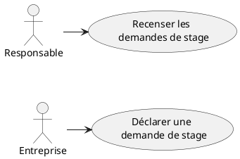

En vous inspirant du code suivant (pour ne pas démarrer à vide), réalisez un diagramme des UC correspondant au sujet.

```plantuml
@startuml

usecase r as "Recenser les \n demandes de stage"
usecase d as "Déclarer une \n demande de stage"

actor Responsable
actor Entreprise 

'Pour aligner les 2 acteurs :
r -[hidden]-> d

Responsable -> r
Entreprise -> d

@enduml
```