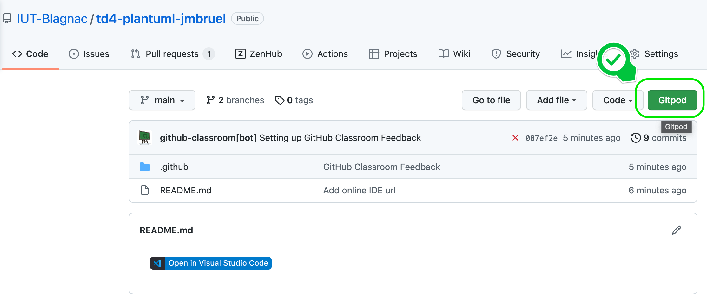
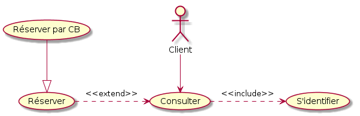
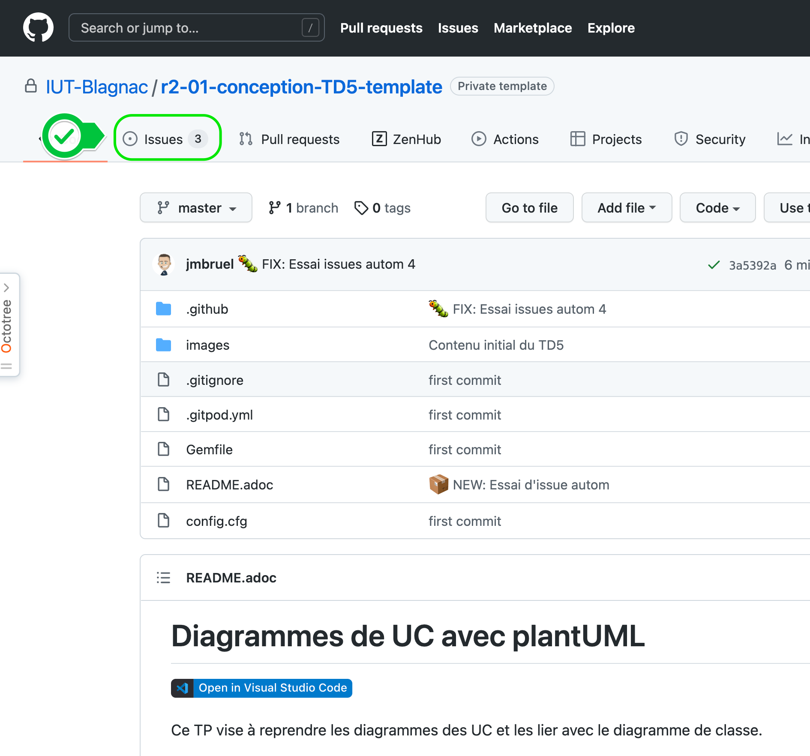

= Diagrammes de UC avec plantUML
Jean-Michel Bruel <jbruel@gmail.com>
v1.0, 2022-03-06 : Initial draft
:icons: font
:diagrams: .
:experimental:
:classroom-link: https://classroom.github.com/a/yVPdUrR4

// Useful definitions
:asciidoc: http://www.methods.co.nz/asciidoc[AsciiDoc]
:icongit: icon:git[]
:git: http://git-scm.com/[{icongit}]
:plantuml: https://plantuml.com/fr/[plantUML]
:vscode: https://code.visualstudio.com/[VS Code]

// Specific to GitHub
ifdef::env-github[]
:toc:
:tip-caption: :bulb:
:note-caption: :information_source:
:important-caption: :heavy_exclamation_mark:
:caution-caption: :fire:
:warning-caption: :warning:
:icongit: Git
endif::[]

//---------------------------------------------------------------

Ce TP vise à reprendre les diagrammes des UC et les lier avec le diagramme de classe.

== À propos...

NOM:: DOE

Prénom:: John

Groupe #::

[%interactive]
- [X] Enseignants
- [ ] 1
- [ ] 2
- [ ] 3
- [ ] 4

== Mise en place

Si vous lisez ce document c'est que vous avez réalisé la manipulation suivante :

. Vous avez créé un dépôt en cliquant sur le lien : {classroom-link}
. Vous avez ouvert ce fichier dans votre {vscode} (si vous l'avez sur votre machine) ou sur la version en ligne via github.dev (recommandé pour un premier TP , surtout si vous ne connaissez pas {git}).

Pour lancer un EDI directement sur le web depuis votre dépôt {git} :

TIP: Si vous n'avez pas ce bouton "GitPod", tapez `gitpod.io/#` devant l'URL de votre dépôt (ou tapez sur le caractère ".").

WARNING: Vérifiez bien que vous n'avez pas ouvert le dépôt d'un autre étudiant, nous avons des soucis avec les _credentials_ git qui ne se ré-initialisent pas au redémarrage des machines.
== Rappel du cours

Le *Diagramme des Cas d'Utilisation* est un modèle UML permettant de représenter :

- les *UC* (_Use Case_ ou Cas d’Utilisation)
- les *acteurs* (principaux et secondaires)
- les *relations* entre acteurs et UC

[NOTE]
=====================================================================
On notera simplement +UC+ pour signifier "diagramme des UC"
=====================================================================

=== Définition et concepts

==== Cas d'Utilisation (_Use Case_ ou UC en abrégé).

[[uc]]
Un cas d'utilisation représente un ensemble de *scénarios* que le système doit exécuter pour produire un résultat observable par un <<acteur,*acteur*>>.

===== Exemple d'UC: cas du retrait par carte bancaire

Scénario principal::
	L'UC démarre lorsque le Guichet Automatique Bancaire (GAB) demande au client son numéro confidentiel après l’introduction de sa CB. Le client
	entre son code et valide son entrée. Le GAB contrôle la validité du code. Si le code est valide, le GAB autorise
	le retrait et l’UC se termine.
Scénario alternatif n°1 ::
	Le client peut à tout instant annuler l'opération. La carte est éjectée et l'UC se termine.
Exemple de codification de l'UC::
	UC01 ou RetraitCB (pour Retrait par carte bleue)

===== Précisions

Un cas d'utilisation peut être précisé par :

- une description textuelle
- un ou des diagrammes UML (séquence, activité)

[NOTE]
=====================================================================
Dans les outils, cette "précision" se manifeste par le fait que l'on "attache"
généralement un diagramme de séquence à un cas d'utilisation (clic droit sur un UC -> nouveau diagramme de séquence).
=====================================================================

==== Acteur

[[acteur]]
Un acteur peut être une personne, un ensemble de personnes, un logiciel, ou un processus qui interagit avec un ou plusieurs <<uc,UC>>.

On peut trouver plusieurs types d'acteurs :

* extérieurs au système (cf. +actor+ <<ucdiag,Diagramme d'UC ci-après>>)
** les acteurs principaux 
** les acteurs secondaires 
** les administrateurs (ils gèrent le système : données, sécurité, droits d'accès, utilisateurs...)

==== Relations entre UC

Extension (+<<extend>>+)::
	Indique que l’UC source est *éventuellement* exécutée en complément de l’UC destination (cas particulier, erreur...)
Inclusion (+<<include>>+)::
	Indique qu’un UC est inclus *obligatoirement* dans un autre UC (notion de sous-programme par exemple)
Généralisation::
	Relation entre un UC général et un autre plus spécialisé qui hérite de ses caractéristiques et en rajoute

ifdef::slides[<<<]

[[ucdiag]]
.Notation dans le diagramme d'UC

[TIP]
=====================================================================
On n'utilise généralement +<<include>>+ que dans le cas où le sous-cas d'utilisation est
inclut dans plusieurs UC. Si ce n'est pas le cas, il est généralement englobé dans l'UC.
=====================================================================

=== Pour construire un UC (de manière générale)

. identifier les acteurs
. identifier les cas d'utilisation
. structurer en _packages_
. ajouter les relations
. finaliser les diagrammes de cas d'utilisation

== Exercices

WARNING: Les diagrammes sont à réaliser comme les TD précédents, en utilisant votre éditeur en ligne (GitPod conseillé) ou en local si vous savez ensuite "pousser" vos modifications locales vers le dépôt distant (commandes add, commit, push)

=== Description du sujet

Une entreprise de construction souhaite informatiser la gestion de ses chantiers.
Elle a un certain nombre d'employés, tous artisans, chacun ayant une spécialité.
Un artisan peut être affecté à plusieurs chantiers en même temps.

L'entreprise souhaite pouvoir, grâce à ce système informatique :

- Gérer ses chantiers (date de début, de fin, adresse, ...)
- Gérer ses artisans (salaire horaire, coordonnées, ...)
- Gérer quels artisans sont affectés à quels chantiers (nombre d'heures effectuées par tel artisan sur tel chantier, début et fin de mission sur un chantier, ...)
- Calculer automatiquement la paye d'un artisan donné pour un chantier donné

=== Description des questions

Les sujets des questions apparaitront sous la forme d'_Issues_ (cf. explications du prof) dès que vous aurez poussé votre première modification sous la forme du la mise à jour de ce fichier `README.adoc` avec vos noms et prénoms.

Les _Issues_ sont ici :

.Les tâches (_issues_) sous GitHub

== Résultats attendus

- Un fichier `uc.plantuml` à la racine de votre projet, contenant votre diagramme des UC.
- Un fichier `dc.plantuml` à la racine de votre projet, contenant votre diagramme de classes (final).
